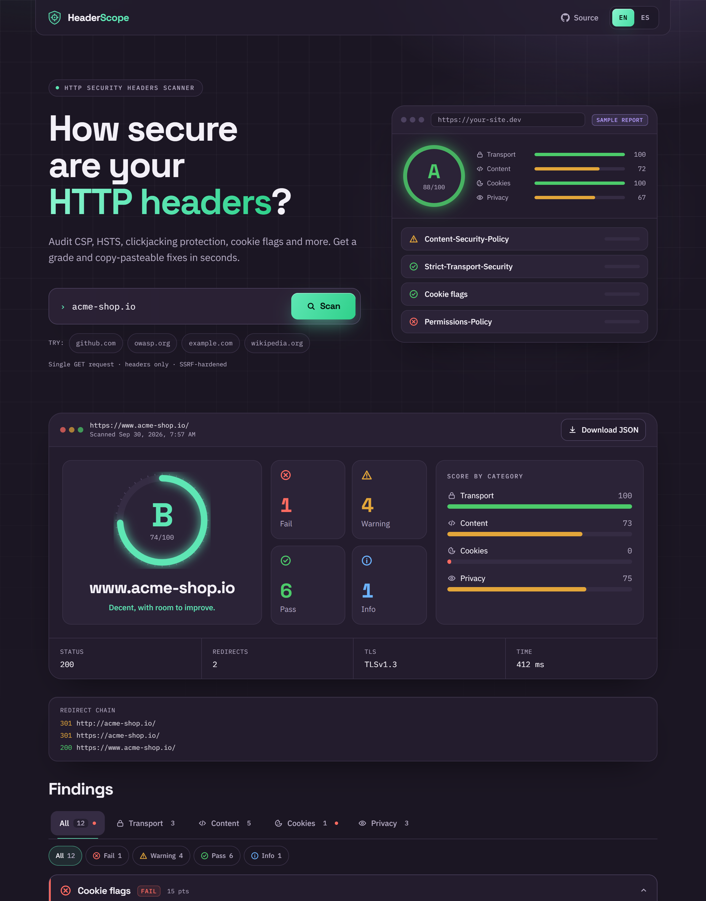

# HeaderScope

**Live demo: [headerscope.vercel.app](https://headerscope.vercel.app)**

**Scan any website's HTTP security headers, get a grade, and learn exactly how to fix what's missing.**

HeaderScope sends a single request to a URL, follows its redirects, and audits the response headers against current best practices (OWASP Secure Headers Project, MDN, Mozilla Observatory). Every finding comes with an explanation, a recommendation and a copy-pasteable example.



Available in **English and Spanish**: switch with the EN/ES toggle in the header. The whole UI is translated, including every finding, detail and recommendation.

## What it checks

| Check | What it looks for | Weight |
| --- | --- | --- |
| **HTTPS** | Site served over TLS; HTTP → HTTPS redirect | 20 |
| **TLS & certificate** | Negotiated protocol (flags TLS 1.0/1.1), certificate expiry | 10 |
| **Strict-Transport-Security** | Present, `max-age` ≥ 6 months, `includeSubDomains`, `preload` | 15 |
| **Content-Security-Policy** | Present and enforcing; flags `'unsafe-inline'` (without nonce/hash), `'unsafe-eval'`, wildcard sources, missing `object-src` / `base-uri`; understands `'strict-dynamic'` | 25 |
| **Clickjacking protection** | CSP `frame-ancestors` or `X-Frame-Options`; flags obsolete `ALLOW-FROM` | 15 |
| **X-Content-Type-Options** | `nosniff` | 10 |
| **Referrer-Policy** | Explicit, non-leaky policy (handles fallback lists) | 10 |
| **Permissions-Policy** | Present (flags deprecated `Feature-Policy`) | 5 |
| **Cross-Origin-Opener-Policy** | `same-origin` / `same-origin-allow-popups` | 5 |
| **Cookie flags** | `Secure`, `HttpOnly`, `SameSite`, `__Host-`/`__Secure-` prefix rules — per cookie | 15 |
| **Information disclosure** | Versioned `Server`, `X-Powered-By`, `X-AspNet-Version`, etc. | 5 |
| **X-XSS-Protection** *(info)* | Deprecated auditor still enabled | – |
| **CORS** *(info)* | `Access-Control-Allow-Origin` exposure | – |

**Scoring:** pass = full weight, warning = half, fail = 0; informational checks aren't scored. The score maps to a grade: A+ (≥95), A (≥85), B (≥70), C (≥55), D (≥40), F.

## Languages (EN / ES)

The app ships in English (default) and Spanish, without locale routes:

- **Typed dictionaries** ([`en.ts`](src/lib/i18n/en.ts), [`es.ts`](src/lib/i18n/es.ts)). English is the source of truth; the Spanish dictionary is typed against it, so a missing key or a wrong parameter is a compile error. Tests also check both locales have the same keys.
- **Checks emit messages, not strings.** Each check returns `{ key, params }` descriptors. `buildReport(input, result, locale)` renders them into strings, so the JSON API stays human-readable, and each check also carries the language-neutral `messages`. The UI renders from those, so switching language re-translates a report on screen without rescanning.
- **Remembered in a cookie** (`hs-locale`), so the server renders the right language and `<html lang>` on the first paint, with no flash of English.
- Header names, directives and code examples are never translated.

## Security of the scanner itself

A tool that fetches arbitrary URLs on a server is a classic **SSRF** (Server-Side Request Forgery) vector: without protections, anyone could use it to reach `localhost`, internal services, or cloud metadata endpoints like `169.254.169.254`. HeaderScope defends against this in layers:

- **URL validation** ([`ssrf.ts`](src/lib/scanner/ssrf.ts)): only `http`/`https`, no embedded credentials, only ports 80/443/8080/8443, no `localhost` / `.local` / `.internal` hosts, no private/reserved IP literals (including IPv4-mapped IPv6, NAT64 and hex/decimal tricks).
- **Connect-time IP check** ([`fetcher.ts`](src/lib/scanner/fetcher.ts)): a custom DNS `lookup` rejects any hostname that resolves to a private or reserved range (RFC 1918, loopback, link-local, CGNAT, multicast, ULA…). Because validation happens on the exact IP the socket connects to, **DNS rebinding** can't slip past it.
- **Every redirect hop is re-validated**, so a public site can't bounce the scanner to an internal address. Max 5 redirects.
- **Resource limits:** 8 s timeout, response body is never downloaded (headers only), header size capped.
- **Rate limiting:** 10 scans per minute per IP ([`rate-limit.ts`](src/lib/rate-limit.ts)).

And it practices what it preaches: the app ships a **nonce-based strict CSP** (via [`proxy.ts`](src/proxy.ts)), HSTS, `nosniff`, `frame-ancestors 'none'`, COOP, Permissions-Policy, and hides `X-Powered-By`.

## Tech stack

- [Next.js 16](https://nextjs.org/) (App Router, Route Handlers, Proxy) + TypeScript
- Tailwind CSS v4, IBM Plex Sans / Mono self-hosted via `next/font` (no external requests, so the strict CSP holds)
- Node's `http`/`https`/`tls`/`dns` modules for low-level control over requests
- [Vitest](https://vitest.dev/) — 90+ unit and integration tests
- GitHub Actions CI (lint, typecheck, tests, build)

## Getting started

```bash
git clone https://github.com/joaquinbarbetta/headerscope.git
cd headerscope
npm install
npm run dev
```

Open http://localhost:3000.

| Script | Description |
| --- | --- |
| `npm run dev` | Start the dev server |
| `npm test` | Run the test suite |
| `npm run typecheck` | TypeScript check |
| `npm run lint` | ESLint |
| `npm run build && npm start` | Production build |

### API

```bash
curl -X POST http://localhost:3000/api/scan \
  -H "Content-Type: application/json" \
  -d '{"url": "example.com", "lang": "es"}'
```

Returns a JSON report with `grade`, `score`, `counts`, `checks[]`, raw `headers`, `redirects` and `tls` info. `lang` is optional (`"en"` by default, or `"es"`) and sets the language of the check texts and error messages.

## Project structure

```
src/
├── app/
│   ├── api/scan/route.ts     # POST /api/scan — rate limit, validation, error mapping
│   ├── page.tsx              # Landing page
│   └── layout.tsx
├── components/               # Scanner form, report, check cards, language toggle
├── lib/
│   ├── i18n/
│   │   ├── en.ts / es.ts     # Typed dictionaries
│   │   ├── index.ts          # Message type, translate()
│   │   └── errors.ts         # Scan errors → translatable messages
│   ├── scanner/
│   │   ├── ssrf.ts           # URL + IP validation
│   │   ├── fetcher.ts        # Safe HTTP client (redirects, TLS info)
│   │   ├── checks.ts         # One function per security check
│   │   ├── csp.ts            # CSP parser and auditor
│   │   ├── cookies.ts        # Set-Cookie parser
│   │   └── index.ts          # Scoring and report building
│   └── rate-limit.ts
└── proxy.ts                  # Per-request CSP nonce
tests/                        # Vitest suites
```

## Deploying

Works on any Node host. On Vercel, import the repo and deploy — no configuration needed. Note that the in-memory rate limiter is per instance; for serverless deployments at scale, swap it for a shared store (e.g. Upstash Redis).

## Roadmap

- [ ] Shareable report links
- [ ] Compare two scans (before / after a fix)
- [ ] CLI (`npx headerscope example.com`) for CI pipelines
- [ ] Server config snippets per platform (nginx, Apache, Vercel, Netlify, Cloudflare)
- [ ] Scan history

## Ethical use

HeaderScope makes a single, ordinary `GET` request — the same thing a browser does. Still, only scan sites you own or have permission to test.

## License

[MIT](LICENSE)
